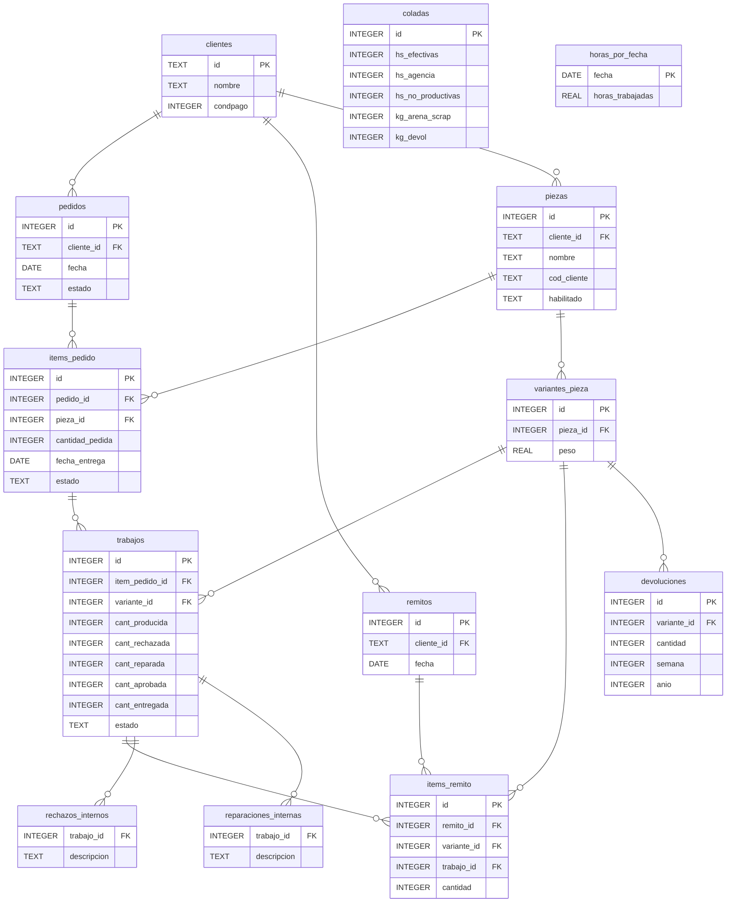

# Estructura de gnc.db — Mapa de relaciones completo

**Generado:** 2026-07-15  
**Fuente:** Access `datosunificado2010.accdb` → sync → SQLite  
**Tamaño:** 72 MB, 124 tablas

---

## 1. Cadena principal de joins (90% de las queries de la app)

```
Clientes ──────────────────────────────┐
   │ códigocliente                      │ códigocliente
   │                                    ↓
   └──► Pedidos ──────────────────────► Remitos
            │ idpedido                     │ idnroremito
            ↓                              ↓
       ItemDetallePedido              ItemDetalle
            │ iditempedido    ←── iditemtrabajo ──┐
            │ idpieza ──────┐                      │
            ↓               ↓                      │
          Trabajos      NombreDePiezas             │
            │ idpesopieza ──────────────────────────┘
            ↓
       PesosDePiezas
            │ nombredepiezasid_
            ↓
       NombreDePiezas (ya arriba — los dos convergen aquí)
```

**Lectura:** un Pedido tiene N items (ItemDetallePedido), cada item apunta a una pieza lógica (NombreDePiezas). Por cada item se crean N OTs (Trabajos), que apuntan a la variante f��sica de la pieza (PesosDePiezas). Las entregas van a Remitos → ItemDetalle, que también apunta a la OT y a la variante física.

---

## 2. Subtema: Calidad

```
Trabajos
  ├──► SoluciónRechazoInterno   (IdItemTrabajo)   — motivo de rechazo interno
  └──► SoluciónReparacionInterna (IdItemTrabajo)  — tipo de reparación interna

PesosDePiezas (códpieza)
  └──► ItemDevolución            (códpieza)        — devoluciones de clientes
            └──► SoluciónDevoluci��n (iddevol)       — descripción libre de la devolución

RechDevol — tabla paralela, agrupa rechazos+devoluciones (¿duplicado? verificar con Access)
```

**Nota:** `ItemDevolución` tiene 82 columnas. Las primeras ~40 son flags con trailing `_` (ej: `colocarfiltro_`) que parecen duplicados de las siguientes ~40 sin underscore. A confirmar si los con `_` son obsoletos.

---

## 3. Subtema: Producción / Colada

```
Fundiciones (códfundición)
  ├──► FundiciónPorFecha    — fecha de cada colada (1 a N por si hubo 2 turnos)
  ├──► ItemProducción       — piezas moldeadas en esa colada (códpieza → PesosDePiezas)
  ├──► InformesMateriales   — composición química por material y colada
  └──► InformesEspesores    — dureza medida por espesor y material
  
HorasPorFecha              — horas trabajadas por fecha (sin FK directa a Fundiciones)
EstadisticaMoldeo          — timestamps de inicio/fin moldeo por OT (iditemtrabajo → Trabajos)
```

**Nota:** `FundiciónPorFecha` tiene solo `fecha + comida*` (hora de almuerzo). La relación colada↔fecha no está en esa tabla sino en `Fundiciones.códfundición` + la fecha se deduce de otra fuente. Verificar en Access cuál es el join correcto.

**Nota:** `ItemProducción.códpieza` es NULL en el 72% de los casos — parece que el campo se dejó de usar y se usa `idtrabajo` en su lugar.

---

## 4. Subtema: Modelos de moldeo

```
Modelos (códigomodelo)
  ├──► PiezasPorModelo   (códmodelo → Modelos, códpieza → NombreDePiezas)
  ├──► MovimientoModelos (códigomodelo) — historial de entradas/salidas
  ├──► FotosDeModelos    (códigomodelo) — fotos
  ├──► PartesPorModelo   (códmodelo �� Modelos, idpartedemodelo → PartesDeModelo)
  └── Clientes           (códigodueño → Clientes.códigocliente) — dueño del modelo
  
PartesDeModelo (idpartedemodelo)  — cada parte física de un modelo (placa, noyo, etc.)
```

---

## 5. Subtema: Reclamos / No conformidades

```
Documentos (iddoc)
  ├──► TiposDocumento    (idtipodoc)             — tipo: IRC, AC, AP, etc.
  ├── Clientes           (códigocliente)
  └──► ItemReclamo       (refdocreclamo → iddoc) — piezas involucradas
  
DocumentoReclamo (refdocumentocalidad → Documentos.iddoc) — documentos externos adjuntos
CausasPorReclamo (refdocumento → Documentos.iddoc) — causas formales del reclamo
SolucionesPorReclamo (?)  — soluciones formales del reclamo
```

---

## 6. Lookups (tablas de referencia pequeñas)

| Tabla | Filas | PK | Descripción |
|---|---|---|---|
| `TipoCondicionPago` | 20 | `idcondpago` | contado, 30 días, etc. |
| `TiposDocumento` | 4 | `idtipodoc` | IRC, AC, AP, Mejora |
| `TiposModelo` | 47 | `tipomodelo` | clasificación de modelos |
| `TiposOperacionModelo` | 7 | `codigo` | S=salida, E=entrada, etc. *(creada por la app)* |
| `Responsables` | 128 | `códigoresponsable` | operarios y responsables |
| `Materiales` | 152 | `especificaciónmaterial` | norma ASTM, etc. |
| `Estados` | 20 | `códigoestado` | estados de OT/pedido |
| `DefectosInternos` | 39 | `códigodefecto` | lookup de defectos (¿se usa en Access?) |
| `Causas` | 33 | `idcausa` | causas formales de reclamo |
| `Espesores` | 12 | `códespesor` | categorías de espesor de pared |
| `TiposDeMoldeo` | 26 | — | tipos de proceso de moldeo |
| `Años` / `Años2` | 27/19 | — | lista de años (¿para filtros en Access?) |

---

## 7. Tablas sin uso en la app — clasificación

### Probablemente útiles (datos actuales, vale explorar)
| Tabla | Filas | Notas |
|---|---|---|
| `AumentosHistoricos` | 484 | Historial de aumentos de precio por cliente — útil para gráficas |
| `Domicilios` | 1,132 | Direcciones de clientes — podría mostrarse en detalle cliente |
| `EstadisticaMoldeo` | 8,497 | Timestamps moldeo por OT — con esto se calcula tiempo de ciclo |
| `PreciosHistóricos` | 50,110 | Historial de precios — útil para análisis |
| `RemitosHistoricos` | 74,373 | Remitos históricos — verificar si son previos al sistema actual |
| `DefectosInternos` | 39 | Lookup de defectos — ¿el mismo que usa `SoluciónRechazoInterno`? |
| `ComposiciónQuímica` | 65 | Quím. por colada (distinto de `InformesMateriales`?) |
| `AnalisisMatLiqInduccion` | 7 | Análisis metal líquido — pocos datos |

### Vacías o sin datos útiles (descartar)
| Tabla | Filas | Razón |
|---|---|---|
| `InformesMaterialesQuimicos2` | 9,930 | Todos los campos químicos son 100% NULL |
| `CambiosFechaCierre` | 0 | Vacía |
| `CambiosFechaVerificación` | 0 | Vacía |
| `CamposForm/Rpt/Tabla` | 0 | Vacías, metadata de forms Access |
| `CantidadesPorParte` | 0 | Vacía |
| `ComentariosOT` | 0 | Vacía — podría ser útil si se usa en el futuro |
| `TrabajosNoyería` | 0 | Vacía |
| `InfTécnicaRebaba` | 0 | Vacía |
| `TemporalMovimientoStock` | 0 | Tabla temporal de Access |
| `TarjetasEnviadasOtros` | 0 | Vacía |
| `NotasDeEnvio` | 1 | 1 sola fila — parece abandonada |

### Metadatos de Access (no sincronizar)
| Tabla | Razón |
|---|---|
| `Acciones`, `Bases`, `CategoríasObjetos`, `Objetos` | Sistema de permisos de Access |
| `Permisos` | Sistema de permisos de Access |
| `RelaciónCampos`, `CamposForm`, `CamposRpt`, `CamposTabla` | Metadata de formularios Access |
| `Campañas` | 1 sola fila "Sin Definir" |
| `FechasViejo` | 31 filas, reemplazado por `FundiciónPorFecha` |
| `Años`, `Años2` | Listas de años para combos de Access |

---

## 8. Problemas conocidos a verificar con el Access

1. **`FundiciónPorFecha` vs `Fundiciones`**: ¿Cuál es el join correcto para obtener la fecha de una colada? `FundiciónPorFecha` no tiene `códfundición`, solo `fecha`. 

2. **`ItemDevolución` — columnas duplicadas**: Hay ~40 columnas con `_` al final (ej: `fundirfrío_`) que parecen ser flags INTEGER/TEXT obsoletos, y otras ~40 sin `_` que son los valores actuales. Confirmar.

3. **`DefectosInternos` vs `SoluciónRechazoInterno`**: DefectosInternos tiene un lookup con códigos numéricos. SoluciónRechazoInterno tiene texto libre. ¿Se sincronizan? ¿Son el mismo dato?

4. **`ItemProducción.códpieza` — 72% nulos**: Parece que se dejó de usar. El link real sería `idtrabajo → Trabajos.iditemtrabajo`. ¿Confirmar?

5. **`RemitosHistoricos` (74k filas)**: ¿Son remitos anteriores al sistema actual? ¿Mismo formato que `Remitos`? ¿O es una tabla de backup?

6. **`RechDevol`**: Tabla de 1,722 filas — ¿es un agregado de rechazos y devoluciones? ¿Cómo se relaciona con `ItemDevolución` y `Trabajos`?

7. **`NombreDePiezas` — campo `id` vs `PesosDePiezas.nombredepiezasid_`**: La PK de NombreDePiezas se llama `id` (genérico). La FK en PesosDePiezas se llama `nombredepiezasid_` (con trailing underscore). Confirmar que siempre es un entero y que no hay ambigüedad.

---

## 9. Propuesta de nombres limpios (para schema nuevo)

| Tabla Access | Nombre limpio propuesto | Cambio |
|---|---|---|
| `Clientes` | `clientes` | solo minúscula |
| `NombreDePiezas` | `piezas` | simplificado |
| `PesosDePiezas` | `variantes_pieza` | más descriptivo |
| `Pedidos` | `pedidos` | solo minúscula |
| `ItemDetallePedido` | `items_pedido` | snake_case |
| `Trabajos` | `trabajos` | solo minúscula |
| `ItemDetalle` | `items_remito` | más claro |
| `Remitos` | `remitos` | solo minúscula |
| `ItemDevolución` | `devoluciones` | simplificado + sin tilde |
| `SoluciónDevolución` | `soluciones_devolucion` | snake_case sin tilde |
| `SoluciónRechazoInterno` | `rechazos_internos` | simplificado |
| `SoluciónReparacionInterna` | `reparaciones_internas` | simplificado |
| `Fundiciones` | `coladas` | nombre más usado en el taller |
| `FundiciónPorFecha` | `fechas_colada` | snake_case sin tilde |
| `ItemProducción` | `items_produccion` | snake_case sin tilde |
| `HorasPorFecha` | `horas_por_fecha` | snake_case |
| `Modelos` | `modelos` | solo minúscula |
| `PiezasPorModelo` | `piezas_por_modelo` | snake_case |
| `MovimientoModelos` | `movimientos_modelo` | snake_case |
| `FotosDeModelos` | `fotos_modelo` | snake_case |
| `PartesDeModelo` | `partes_modelo` | snake_case |
| `PartesPorModelo` | `partes_por_modelo` | snake_case |
| `Documentos` | `documentos_calidad` | más descriptivo |
| `ItemReclamo` | `items_reclamo` | snake_case |
| `DocumentoReclamo` | `documentos_externos` | más descriptivo |
| `Responsables` | `responsables` | solo minúscula |
| `Materiales` | `materiales` | solo minúscula |
| `TipoCondicionPago` | `condiciones_pago` | snake_case plural |
| `TiposDocumento` | `tipos_documento` | snake_case |
| `TiposModelo` | `tipos_modelo` | snake_case |
| `Estados` | `estados` | solo minúscula |
| `InformesMateriales` | `informes_material` | snake_case |
| `InformesEspesores` | `informes_espesor` | snake_case |
| `EstadisticaMoldeo` | `estadistica_moldeo` | snake_case |
| `ModificacionesStock` | `ajustes_stock` | más claro |
| `MovimientosDeStock` | `movimientos_stock` | snake_case |
| `RechDevol` | `rech_devol` | mantener hasta confirmar propósito |
| `tblInformesControlCalidad` | `control_calidad` | sin prefijo tbl |

---

## 10. Diagrama mermaid �� tablas core



---

## 11. Preguntas pendientes para verificar en Access mañana

- [ ] ¿`FundiciónPorFecha` cómo se relaciona con `Fundiciones`? ¿Por fecha exacta?
- [ ] ¿Las columnas con `_` al final en `ItemDevolución` son obsoletas?
- [ ] ¿`DefectosInternos` (lookup) se relaciona con `SoluciónRechazoInterno` (texto libre)?
- [ ] ¿`RemitosHistoricos` es un archivo histórico o tiene el mismo formato que `Remitos`?
- [ ] ¿`RechDevol` es un resumen calculado o tiene datos propios?
- [ ] ¿`ItemProducción.códpieza` se sigue usando o quedó en desuso?
- [ ] ¿`ComposiciónQuímica` (65 filas) es distinta de `InformesMateriales` (19k filas)?
- [ ] ¿`EstadisticaMoldeo` (8.5k filas) se debería cruzar con `Trabajos`?
